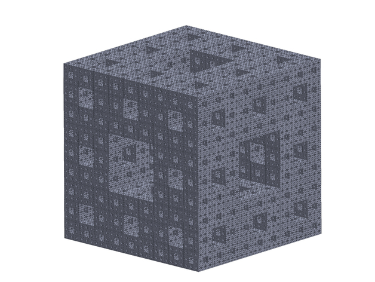
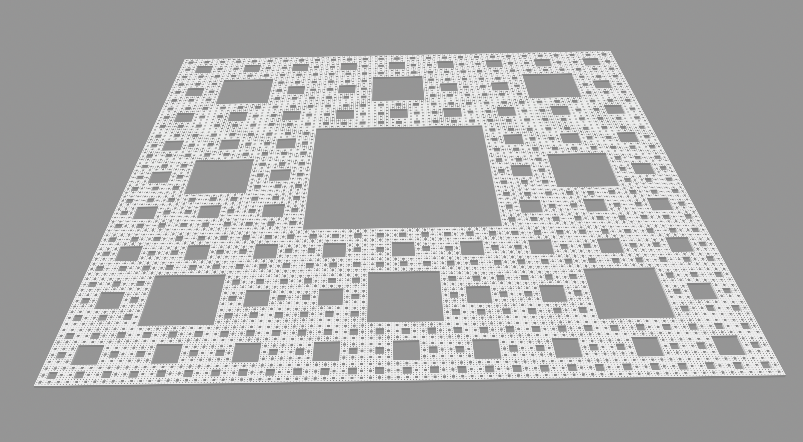
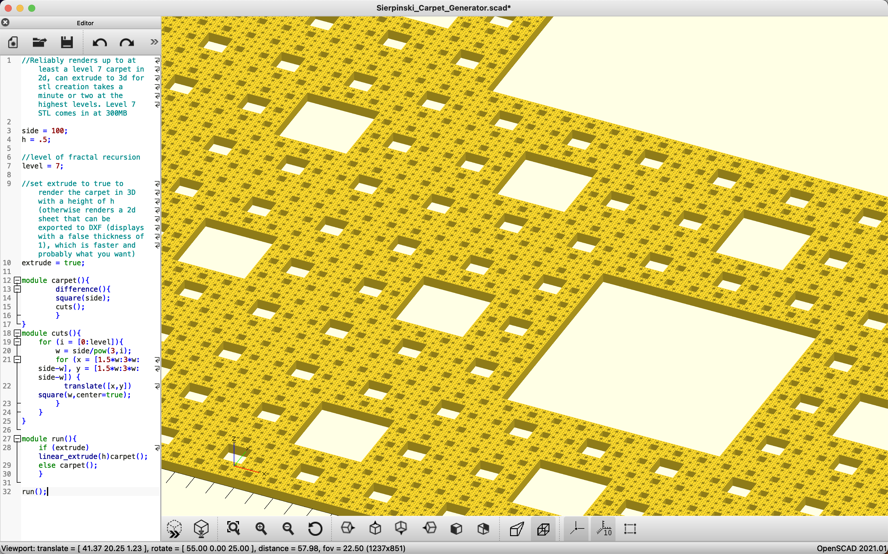
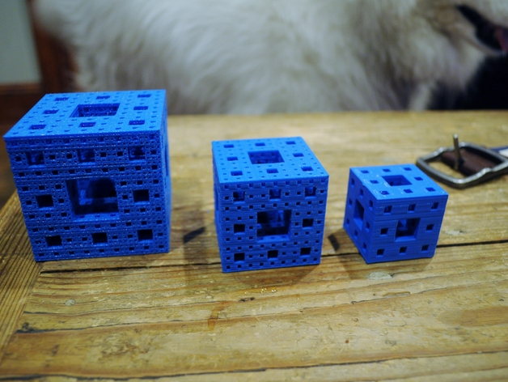
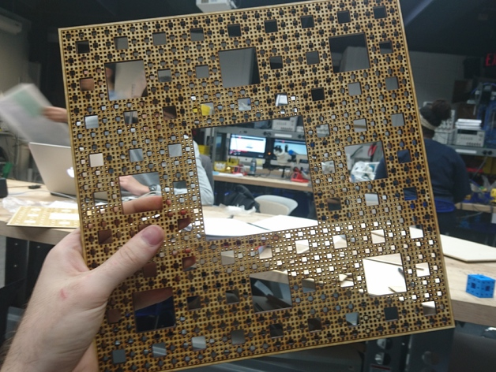

# Square Fractals

My models of some simple fractal geometries. Currently featuring [Sierpinski Tetrahedra](https://en.wikipedia.org/wiki/Sierpi%C5%84ski_triangle#Analogues_in_higher_dimensions), [Menger Sponges](https://en.wikipedia.org/wiki/Menger_sponge) (inspired by  [Stand-up Maths](https://www.youtube.com/watch?v=8pj8_zjelDo)) and related [Sierpiński Carpets](https://en.wikipedia.org/wiki/Sierpi%C5%84ski_carpet). Including STLs of each successuflly rendered model, Solidworks drawings and OpenSCAD code which can successfully render up to a level 4 sponge. Also included DXF and SVG drawings of the 2D carpets.

 OpenSCAD can technically preview the level 5 sponge with not very long a delay, but I have yet to find out how much time it would take for it to render/produce an STL of it. Level 4 took ~65 minutes to render into an STL-able model in OpenSCAD. I managed to create a level 5 in Solidworks by slow piecemeal patterning, but am not sure where that model went. The STL of that sponge is too large for GitHub but can be found on my [GrabCad](https://grabcad.com/library/menger-sponges-1).

(more images available in /*/images directories)

## Models

*Render of a Level 5 Menger Sponge*

*Render of a level 6 Sierpinski Carpet*

*Render of a level 7 Sierpinski Carpet in OpenScad (this model has ~300,000 holes and the STL of the [3d model](https://grabcad.com/library/sierpinski-carpet-fractals-1) is 300MB)*

I managed to render a level 8 carpet in OpenSCAD, but even the 2D DXF is over 500MB which is too large even for GrabCAD. The SVG is a more modest 180MB but still too large for Github, and GrabCAD doesn't take that file format. Available upon request.

## Execution

 Note: If attempting to view the largest Carpet images, the best way is probably to open the .svg file in e.g. Inkscape, and set display mode to Outline. I changed the stroke width from OpenSCAD's default export setting of .5 so that they should be visible, but the easiest way to be able to zoom in on arbitrarily fine detail is to display without stroke widths at all.